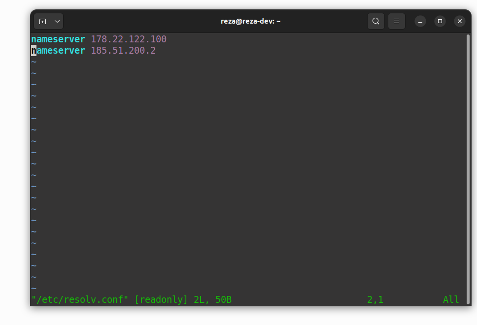
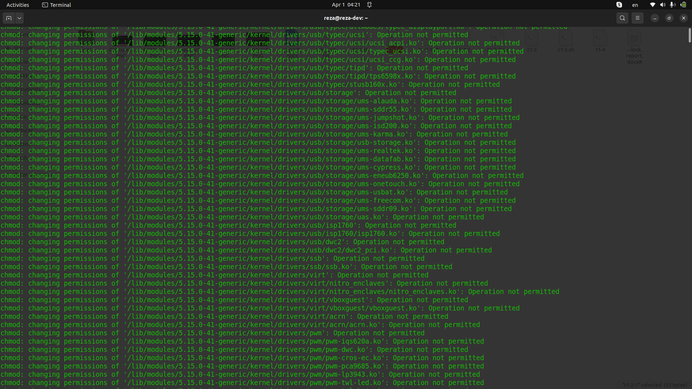
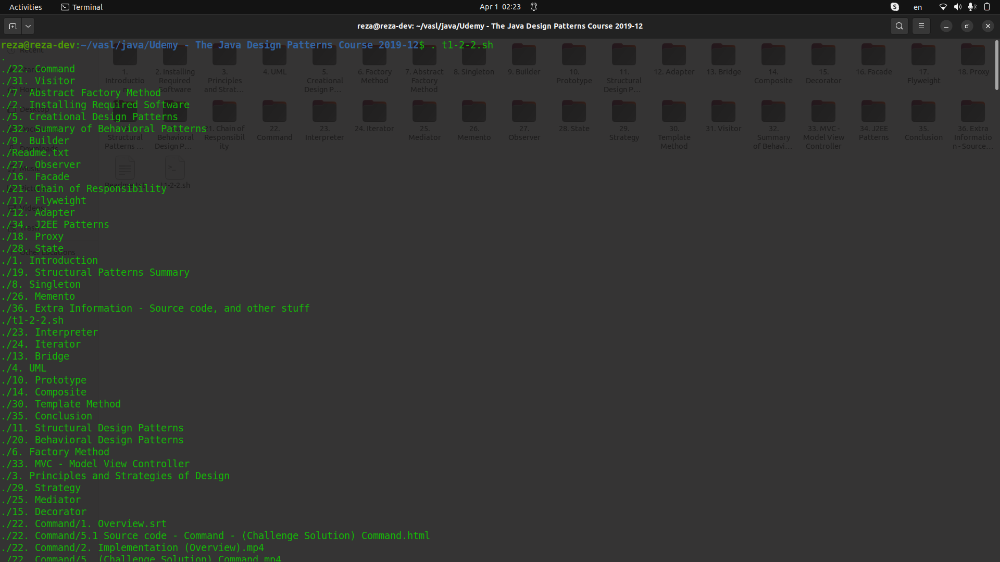
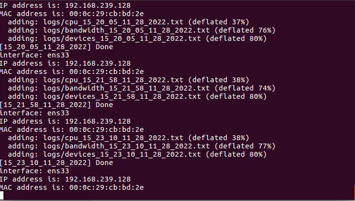
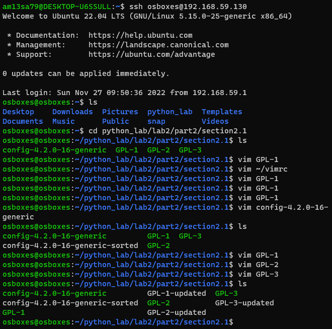

# part 1

## changing DNS 

run the below line in the Linux terminal for super root permission:

```
sudo su
```

then run the below script as a sh file. (save it as .sh file and run it in your terminal.)

```tex
#!/bin/bash
target=/etc/resolv.conf
dns1="nameserver 178.22.122.100"
dns2="nameserver 185.51.200.2"
if ! [ $(id -u) = 0 ]; then
   echo "The script need to be run as root." >&2
   exit 1
fi
echo ${dns1} > ${target} 
echo ${dns2} >> ${target}
echo "shecan dns was set."
```

We can see the changes in the file:



## Section 2

### 1:

It can be done by one line command that changes the permission of files recursively in the addressed directory.

```
chmod -R 777 /lib
```

The result:



we can implement this function as a recursive function represented below:(This function had implemented on the internet)

```
#! /usr/bin/bash


function traverse() {
for file in "$1"*
do
    if [ -f "${file}" ] ; 
    then
        echo "${file} is a file"
        chmod o+w ${file}
    else
        echo "entering recursion with: ${file}"
        traverse "${file}"
    fi
done
}

traverse "$1"
```

Implementing this function in a different way is represented in the below script.

```
#!/bin/bash

traverse() {
  local dirs
  local files
  dirs="$(ls -l | grep "^d" | awk '{print $9}')"
  files="$(ls -l | grep -v "^d" | awk '{print $9}')"
  for dir in ${dirs[@]}
  do
    echo GO INTO "$dir"
    cd "$dir"
    traverse "$1"
  done


  for item in ${files[@]}
  do
  chmod 777 "$item"
  done
  echo "Returning from" "$(echo "${PWD##*/}")"
  cd ..
}
traverse "$1" 

```

### 2:

The below script represents this function:

```
i=0
while results=$(find "$@" -mindepth $i -maxdepth $i) && [[ -n $results ]]; do
  echo "$results"
  ((i++))
done
```

We test this script and function on a specific directory; the result is below.



# Section 3:

Install the necessary packages. (e.g. mpack and iftop) 

for the emailing function you need related packages, be sure to download them by sudo apt-get name_of_the_package. 

for running correctly you should create a directory in your local place your terminal is running and name it "log".

```
mkdir log
```

Run the below script in the terminal.

the useful information will be saved in the log directory and we zip the CPU, network, and device info every 1 minute. the zip file will be sent to the address, here is my Gmail.

```
#!/bin/bash
while [ condition ]
do
    cpu_info=$(grep 'cpu' /proc/stat)
    bandwidth_info=$(iftop -t -s 10)
    log_time=$(date +'%H_%M_%S_%m_%d_%Y')
    echo -e "==============CPU Info [$log_time]==============\n$cpu_info" > ./logs/cpu_$log_time.txt
    echo -e "==============Network Info [$log_time]==============\n$bandwidth_info" > ./logs/bandwidth_$log_time.txt
    echo -e "==============Devices List [$log_time]==============\n$(lspci)" > ./logs/devices_$log_time.txt
    zip ./logs/log_$log_time.zip ./logs/cpu_$log_time.txt ./logs/bandwidth_$log_time.txt ./logs/devices_$log_time.txt
    #tar -zcvf ./logs/log_$log_time.tar.gz ./logs/cpu_$log_time.txt ./logs/bandwidth_$log_time.txt ./logs/devices_$log_time.txt > /dev/null

    mpack -s "System log $log_time" ./logs/log_$log_time.zip alkhieranidish2014@gmail.com
    echo "[$log_time] Done"
    sleep 1m
done
```



## Section 4:

Receive the directory file from sharif ftp.

```
wget ftp://ftp.sharif.ir/ -O directory.html
```

Then run the below script for crawling.

```
while true
do
	filename='direction.html'
	grep  'Directory\|File' $filename > 'List.txt'
	filename1='List.txt'
	clear
	echo "Directory List is like below:"
	cat $filename1 | grep -Eo 'ftp://[^ >]+'
	echo "Choose a Directory or filename:"
	read InputStr
	if grep -q "$InputStr" "$filename1"
	then
		if grep "$InputStr" "$filename1" | grep "Directory"
		then
		address="$(grep -Po '(?<=href=")[^"]*(?=")' "$filename" | grep "$InputStr")"
		echo "$address"
		wget "$address" -O direction.html
		continue
		else
		echo 'Your file will download in a few Seconds:'
		address="$(grep -Po '(?<=href=")[^"]*(?=")' "$filename" | grep "$InputStr")"
		wget "$address"
		break
		fi
	else
		echo "You choose a Wrong Name"
		echo "Want to try again?[Y/n]"
		read InputChar
		if [ "$InputChar" == "Y" ]
		then
		continue
		else
		break
		fi
	fi
done
```


# part 2

## Add ssh public key to the virtual machine
first of all, two host and virtual machines should have running ssh service, so run the below commands on both of them:
```
sudo apt-get install ssh
sudo service ssh start
```
then do the next steps:
1. generate RSA keys on the host:
```
ssh-keygen -t rsa
```
2. copy the public key(for example, ~/.ssh/id_rsa.pub by default) to desired account on the virtual system:
```
scp ~/.ssh/id_rsa.pub osboxes@192.168.59.130:
```
3. create `.ssh` directory and `authorized_keys` file if there aren't exist in the virtual system
```
mkdir -p ~/.ssh
touch ~/.ssh/authorized_keys
```
4. add the content of the public key file to a new line in your `~/.ssh/authorized_keys` file:
```
cat ~/id_rsa.pub >> ~/.ssh/authorized_keys
```
now you can ssh to the virtual machine without entering any password.

## section 2.1
create a directory for this section in virtual systems using ssh:
```
ssh osboxes@192.168.59.130

mkdir -p /home/osboxes/python_lab/lab2/part2/section2.1

mkdir -p /home/osboxes/python_lab/lab2/part2/section2.1
```
copy related file for this section from host to virtual using scp command:
```
scp GPL-1 GPL-2 GPL-3 config-4.2.0-16-generic osboxes@192.168.59.130:/home/osboxes/python_lab/lab2/part2/section2.1
```
ssh to virtual from the host and run commands from the first lab, part 7



## section 2.2
1. copy GPL-1-updated from virtual machine to host using scp:
```
scp osboxes@192.168.59.130:/home/osboxes/python_lab/lab2/part2/section2.1/GPL-1-updated /mnt/e/EE@SUT/python_lab/Lab2/part2
```

2. Change the file by adding the below line to the first line:
```
This file changed in the host system
```

3. Save file:
```
:w GPL-1-updated-changed
```

4. Finally, copy the changed file to the virtual system:
```
scp /mnt/e/EE@SUT/python_lab/Lab2/part2/GPL-1-updated-changed osboxes@192.168.59.130:/home/osboxes/python_lab/lab2/part2/section2.2
```
